# CollabBoard — Architecture & System Design

A real-time collaborative whiteboard. This document explains how everything fits together.

---

## Table of Contents

1. [High-Level Overview](#1-high-level-overview)
2. [Directory Structure](#2-directory-structure)
3. [Tech Stack](#3-tech-stack)
4. [Authentication Flow](#4-authentication-flow)
5. [Database Schema](#5-database-schema)
6. [Routing](#6-routing)
7. [Real-Time Architecture](#7-real-time-architecture)
8. [Canvas System](#8-canvas-system)
9. [AI Agent](#9-ai-agent)
10. [State Management](#10-state-management)
11. [Key Data Flows](#11-key-data-flows)
12. [Performance Design](#12-performance-design)
13. [Security Model (RLS)](#13-security-model-rls)

---

## 1. High-Level Overview

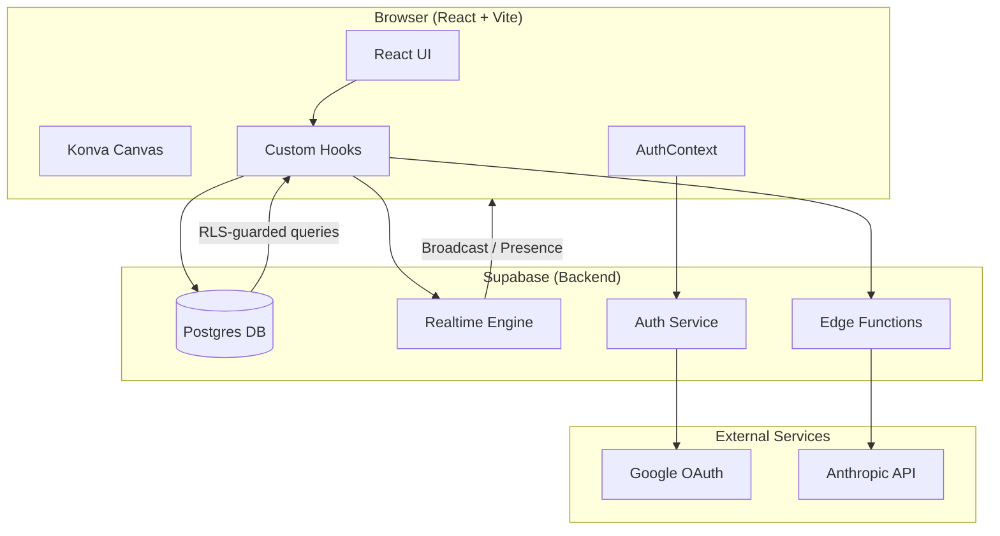

The app is a single-page React app. The browser communicates with Supabase for:
- **Database reads/writes** — persisting canvas objects
- **Realtime broadcast** — syncing live changes between connected users
- **Presence** — tracking who is online
- **Edge Functions** — running AI commands via Anthropic

---

## 2. Directory Structure

```
collab_space/
├── src/
│   ├── components/
│   │   ├── canvas/         # Konva canvas components (StickyNote, Shape, Frame, ...)
│   │   ├── ai/             # AICommandInput
│   │   ├── presence/       # PresenceBar (online user avatars)
│   │   └── utils/          # Dev tools
│   ├── hooks/              # Core business logic
│   │   ├── useRealtimeSync.ts   # Object CRUD + broadcast
│   │   ├── useCursors.ts        # Live cursor positions
│   │   ├── usePresence.ts       # Who is online
│   │   ├── useSelection.ts      # Selected object IDs (local only)
│   │   └── useAIAgent.ts        # AI command execution
│   ├── pages/
│   │   ├── Dashboard.tsx        # Board listing
│   │   ├── CursorTest.tsx       # Main board canvas (misleading name)
│   │   ├── BoardPage.tsx        # Route wrapper → redirects to CursorTest
│   │   ├── LoginPage.tsx
│   │   └── JoinPage.tsx         # Handles invite code links
│   ├── routes/             # TanStack Router file-based routes
│   ├── contexts/
│   │   └── AuthContext.tsx # Supabase auth + user display name
│   └── lib/
│       ├── supabase.ts         # Supabase client
│       └── database.types.ts   # TypeScript DB types (generated)
├── supabase/
│   ├── migrations/         # SQL (run in order: 001 → 004)
│   └── functions/
│       └── ai-agent/       # Deno edge function → Anthropic API
└── e2e/                    # Playwright tests
```

---

## 3. Tech Stack

| Layer | Technology | Why |
|-------|-----------|-----|
| UI framework | React 19 | Component model, concurrent features |
| Language | TypeScript 5.9 | Type safety across the stack |
| Build tool | Vite 7 | Fast HMR during development |
| Styling | Tailwind CSS v4 | Utility-first, no CSS files needed |
| Canvas | react-konva | 2D canvas with React component API |
| Routing | TanStack Router | File-based, fully typed route params |
| Server state | TanStack Query | Caching + refetch for DB queries |
| Global state | Zustand | Lightweight store, minimal boilerplate |
| Backend | Supabase | Postgres + Auth + Realtime + Edge Functions |
| Edge runtime | Deno | AI edge function |
| AI model | Claude Haiku 4.5 | Tool-use for canvas manipulation |
| Tests | Vitest + Playwright | Unit and E2E |
| Package manager | pnpm | Faster installs, strict dependencies |

---

## 4. Authentication Flow

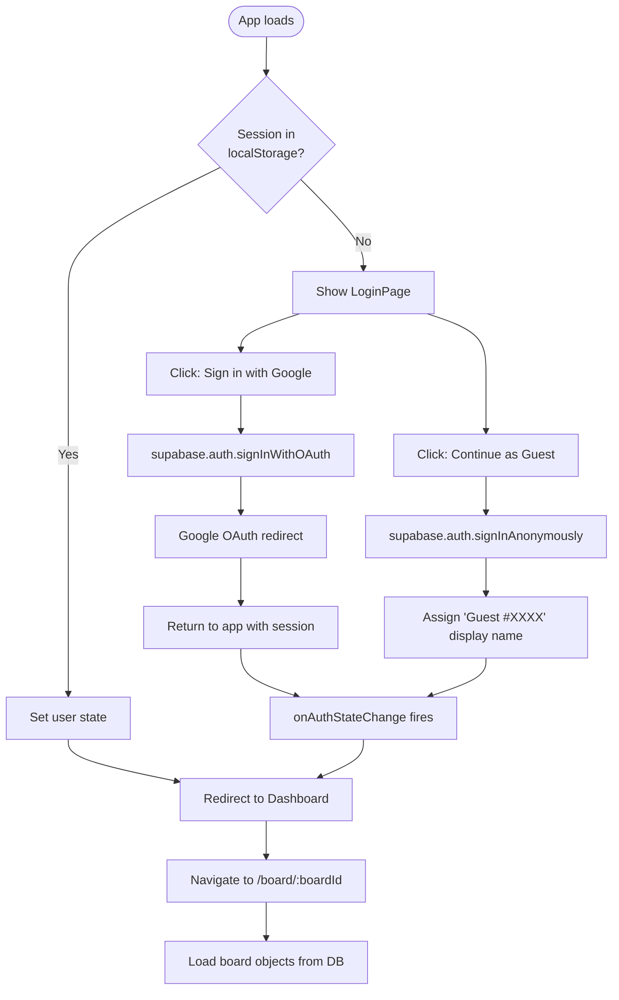

**Where it lives:** `src/contexts/AuthContext.tsx`

The `AuthContext` wraps the whole app. Every component can call `useAuth()` to get the current user, sign out, etc. The `onAuthStateChange` subscription keeps the React state in sync with Supabase's session automatically — even across browser refreshes.

**Display name priority:** `display_name` → `full_name` → `name` → `email` → `"Anonymous"`

---

## 5. Database Schema

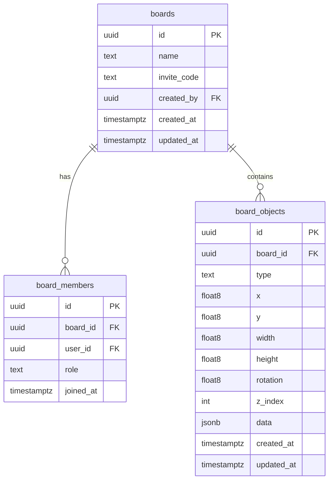

### The `board_objects.data` JSONB Column

Every canvas object shares the same row structure (`x`, `y`, `width`, `height`, `rotation`, `z_index`), but type-specific fields live in the `data` JSON column:

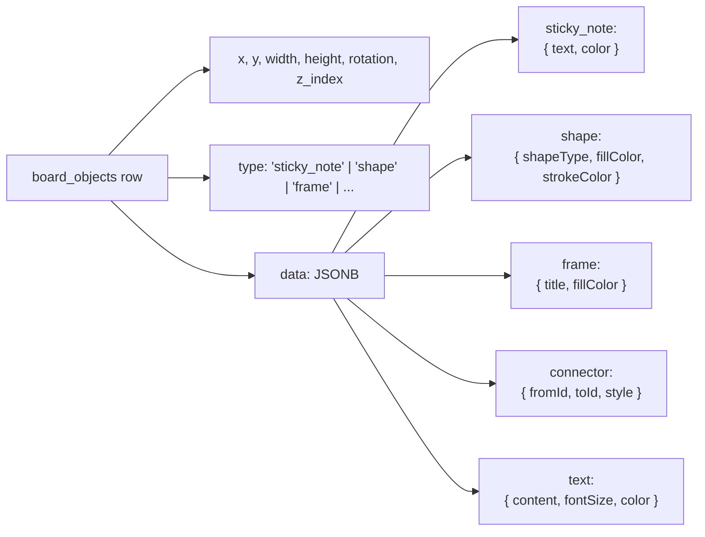

In TypeScript this becomes a **discriminated union** — safe type narrowing:

```typescript
// If obj.type === 'sticky_note', TypeScript knows obj.data has .text and .color
type BoardObject =
  | (Base & { type: 'sticky_note'; data: { text: string; color: string } })
  | (Base & { type: 'shape';       data: { shapeType: string; fillColor: string } })
  | (Base & { type: 'connector';   data: { fromId: string; toId: string } })
  // ...
```

---

## 6. Routing

TanStack Router uses **file-based routing** — the file name _is_ the route pattern.

```
src/routes/
├── __root.ts         →  /           (root layout)
├── index.ts          →  /           (Dashboard)
├── board.$boardId.ts →  /board/:boardId
└── join.$code.ts     →  /join/:code
```

**Never edit `src/routeTree.gen.ts` manually.** It is auto-generated by TanStack Router when you run `vite dev`. Route params are fully typed — `boardId` and `code` come through as `string`.

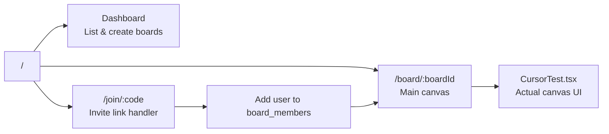

---

## 7. Real-Time Architecture

This is the most complex part of the system. Understanding it is key to understanding the whole app.

### Two Channels Per Board Session

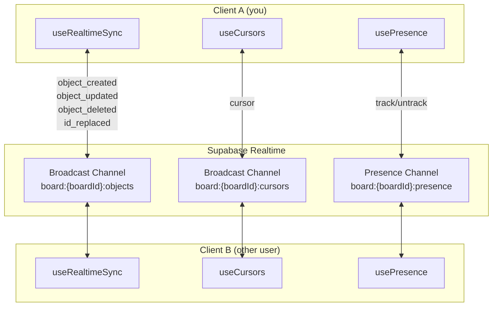

### Optimistic Update Pattern (Object Sync)

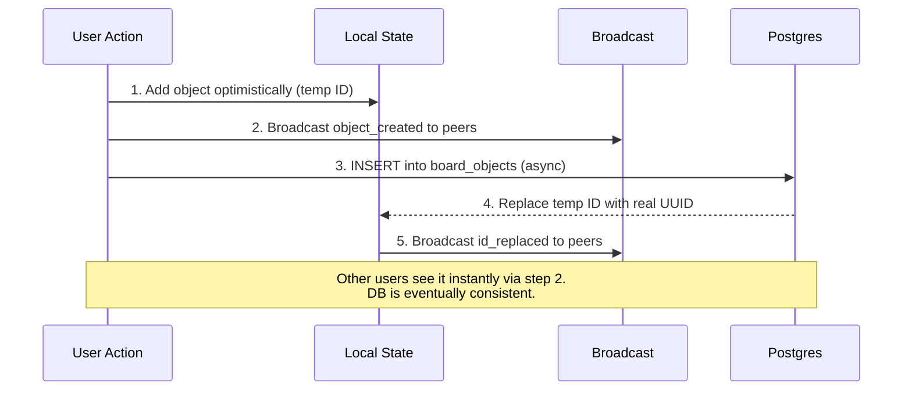

This is the key tradeoff: **instant visual feedback** (steps 1+2) before the database confirms (step 3). If the DB write fails, the optimistic update is rolled back.

### Why Temp IDs Matter

When the AI creates a connector between two sticky notes, it writes the `fromId` and `toId` into the connector's data _before_ those objects have real DB IDs. The temp ID → real ID broadcast (step 5) ensures connectors stay linked even after IDs change.

### Cursor Sync

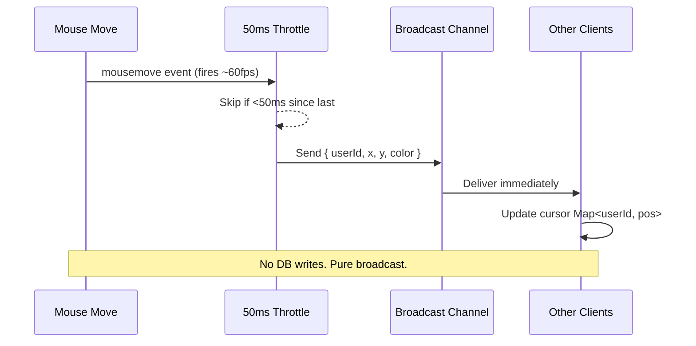

Cursors are **never persisted**. They exist only in memory as a `Map<userId, CursorPosition>`. Stale cursors (no update for 5s) are automatically removed.

### Presence

Uses Supabase's built-in **Presence** feature (CRDT-based distributed state):

```typescript
// Track yourself when you join
channel.track({ userId, userName, avatarUrl })

// Listen for the combined state of all online users
channel.on('presence', { event: 'sync' }, () => {
  const users = Object.values(channel.presenceState()).flat()
  setOnlineUsers(users)
})
```

The PresenceBar at the top of the board shows colored circles for each online user.

---

## 8. Canvas System

The canvas is built with **react-konva** — a React wrapper around Konva.js, which renders to an HTML `<canvas>` element.

### Component Hierarchy

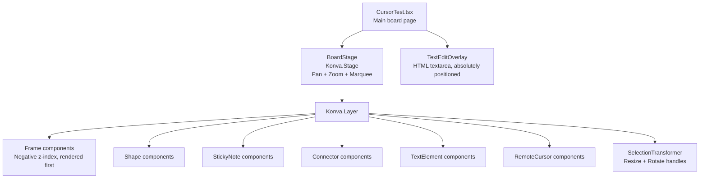

### BoardStage — Pan and Zoom

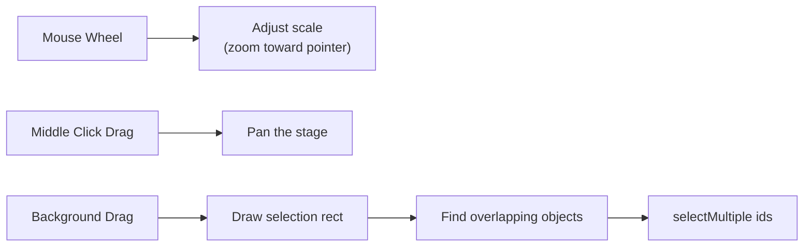

The stage maintains `stagePos` (x, y offset) and `stageScale` (zoom level). Every object's position is in **canvas coordinates** — (0,0) is top-left, X increases right, Y increases down.

### Object Lifecycle

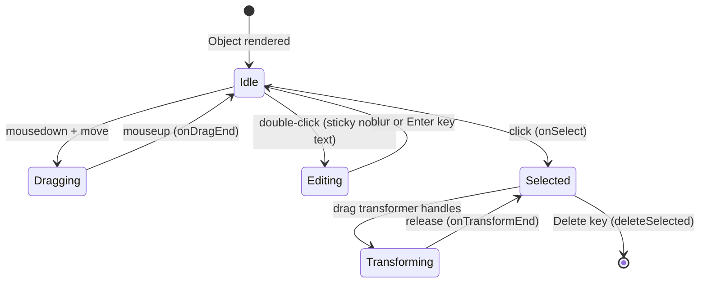

### ConnectorCanvas — Drawing Lines Between Objects

Connectors find the center points of their `fromId` and `toId` objects at render time:

```
fromObject.x + fromObject.width/2  →  line start
toObject.x + toObject.width/2     →  line end
```

If either object has been deleted, the connector hides itself gracefully.

---

## 9. AI Agent

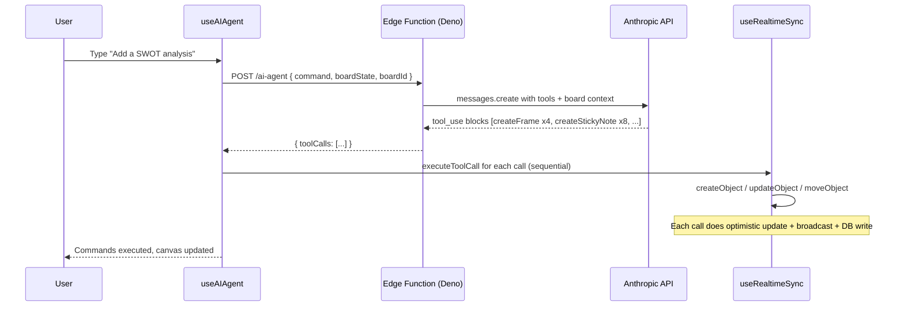

### What the AI Knows

The edge function receives the full **current board state** (all objects, their positions, and their text content) as part of the request. Claude uses this to make sensible layout decisions (e.g., placing new objects to the right of existing ones).

### Available Tools

| Tool | What it does |
|------|-------------|
| `createStickyNote` | Add colored note with text |
| `createShape` | Rectangle, circle, or line |
| `createFrame` | Labeled container box |
| `createTextBox` | Standalone text label |
| `createConnector` | Arrow between two objects |
| `moveObject` | Reposition an existing object |
| `resizeObject` | Change width/height |
| `updateStickyNoteText` | Edit sticky note text |
| `updateTextBoxContent` | Edit text element content |
| `changeColor` | Change fill/stroke color |
| `getBoardState` | No-op (state already in prompt) |

---

## 10. State Management

The app uses **three different state mechanisms** for different purposes:

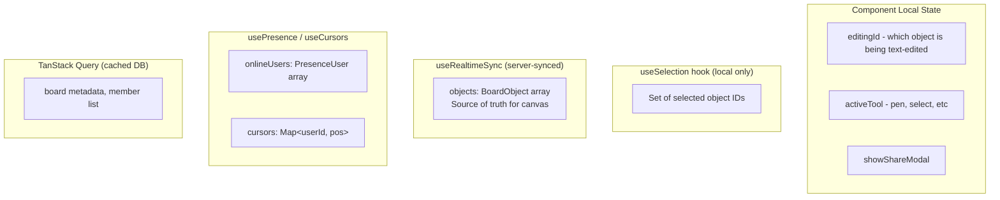

**Selection is intentionally local** — each user has their own selection that other users cannot see. This mirrors how Figma works.

**`objects` in useRealtimeSync** is the single source of truth for everything on the canvas. It starts by loading all rows from `board_objects` where `board_id = :boardId`, then applies live broadcast updates on top.

---

## 11. Key Data Flows

### Creating a Board

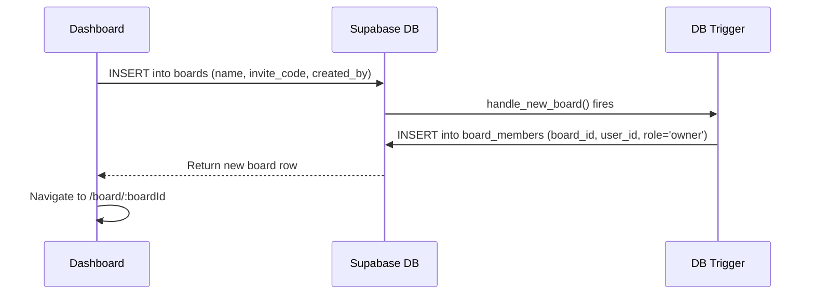

### Joining via Invite Code

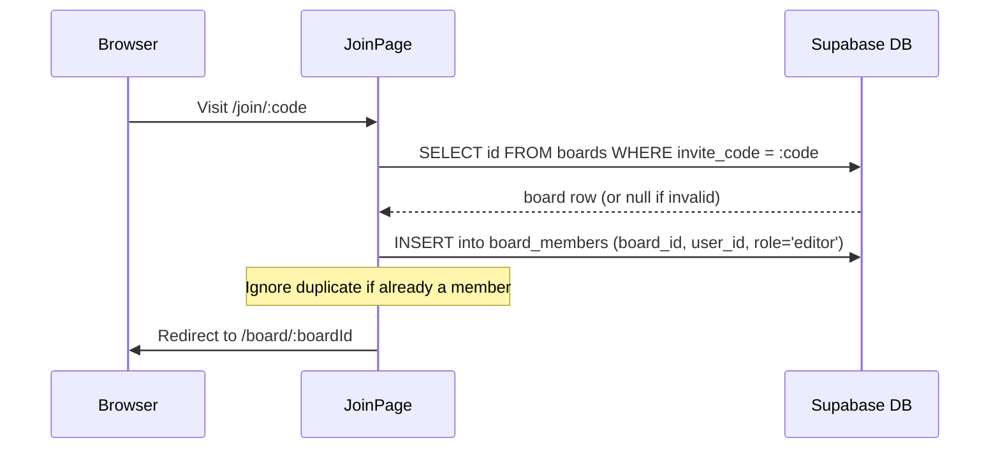

### Deleting an Object

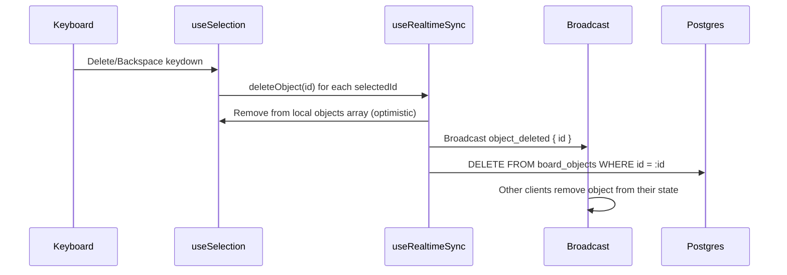

---

## 12. Performance Design

| Concern | Solution |
|---------|----------|
| Cursor updates flooding server | 50ms throttle = max 20 broadcasts/sec |
| Drag updates flooding DB | Broadcast only during drag, DB write only on dragEnd |
| Realtime overload | Supabase client configured at 10 events/second |
| Marquee false triggers | 4px movement threshold before registering drag |
| Re-renders during transform | Refs track Konva nodes, not React state |
| Frame z-ordering | Negative z_index so frames always render below objects |
| Canvas coordinate system | Everything in canvas space; stage pos/scale applied by Konva |

### The Broadcast-First Strategy

```
Cursor moves  →  Broadcast only  (never touches DB)
Object drag   →  Broadcast during, DB on release
Object create →  Optimistic + Broadcast, then DB async
Object delete →  Optimistic + Broadcast, then DB async
```

The rule: **broadcast for speed, DB for durability**.

---

## 13. Security Model (RLS)

Row Level Security policies in Postgres control every table access. The Supabase anon key used in the frontend cannot bypass them.

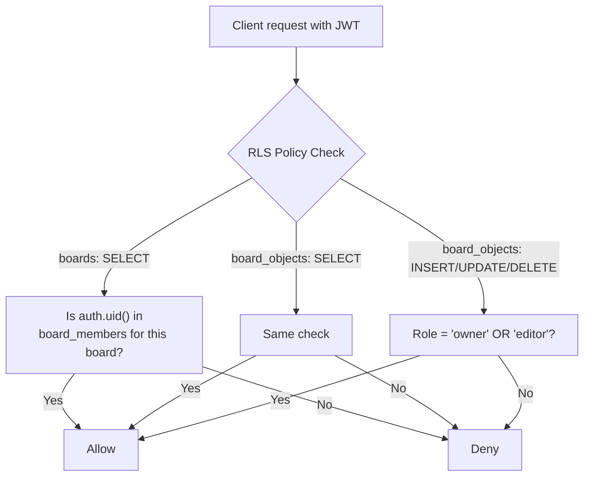

**Auto-triggers ensure consistency:**
- When a board is created, a DB trigger immediately inserts the creator into `board_members` as `owner`
- `updated_at` columns auto-update on every modification

Viewers can read but cannot write. Editors can create/update/delete objects. Only owners can manage board settings and members.

---

## Glossary

| Term | Meaning |
|------|---------|
| **Broadcast** | Supabase Realtime feature for low-latency P2P messages (no persistence) |
| **Presence** | Supabase feature tracking who is currently connected to a channel |
| **RLS** | Row Level Security — Postgres policies that control who can read/write rows |
| **Konva** | JavaScript 2D canvas library; react-konva wraps it for React |
| **Discriminated union** | TypeScript pattern: a type field narrows what other fields exist |
| **Optimistic update** | Updating local UI immediately, before the server confirms success |
| **Temp ID** | `temp_${timestamp}_${random}` placeholder ID before DB assigns a real UUID |
| **Transformer** | Konva component that adds resize/rotate handles to selected objects |
| **TanStack Router** | Type-safe router where file names define route patterns |
| **Edge Function** | Serverless Deno function running on Supabase's infrastructure |
